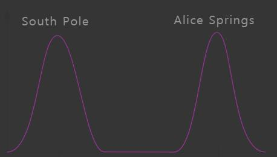

Mode Collapse Problem on GAN
=============

# 1.Intro
생성모델을 공부하던 중, 구글에서 내려받은 DCGAN 예제 코드를 돌리다가, Generator의 활성화 함수가 논문에서 권하는 ReLu가 아닌, Leaky ReLu인 것을 발견하고, 이 부분을 수정하고 다시 학습을 진행시키던 도중, Mode Collapse 문제에 직면했다.

15에폭까지는 정상적으로 학습이 되다가, 16에폭부터 노이즈가 끼더니 전부 하나의 똑같은 노이즈가 되어버렸다가, 숫자 2를 닮은 형상으로도 바뀌었다가 한다. 전형적인 Mode Collapse 현상이라고 한다.

구글링해보니 이것이 무엇이며, 이를 피하기 위해 어떤 기법들이 개발되어 있는지 잘 Overview 해놓은 포스팅(<http://aiden.nibali.org/blog/2017-01-18-mode-collapse-gans/>)이 있었다. 2017년 1월 포스팅으로, 최신 기법들까지 모두 반영하고 있지는 않지만, Mode Collapse에 대해서 매우 직관적으로 잘 설명해 놓았으므로, 원저자의 허가를 받고 이를 번역하여 정리해두기로 하였다. 아랫 단락부터는 해당 포스팅의 번역이다.

# 2.What is Mode Collapse?
한 마디로 표현하면 제너레이터가 아주 적은 Mode의(Low Variety) 샘플만을 생산하도록 학습하는 현상을 말한다.

실생활에서 우리가 흥미를 갖는 대부분의 데이터들의 분포는 매우 복잡하며, Multi-Modal하다. 이는 데이터를 표현하는 확를분포가 여러개의 Peaks를 가졌다고도 말할 수 있다. 각각의 Peak는 데이터에 포함된 여러 Mode의 서브샘플들이 집중된 부분이라 할 수 있겠다.

예를 들어, 우리가 호주 중부 Alice Springs의 여름 기온 Sample과(개덥다고 함) 남극점의 여름 기온 Sample(개춥다고 함)이 섞인 여름 날씨 데이터셋을 가지고 있다고 해보자.

데이터의 분포는  두 장소의 평균 기온이 두 개의 Peak로 나타난 가운데, 그 사이엔 Gap이 있는 Bimodal한 형태를 띈다. 아래 그래프는 이러한 분포를 명확하게 보여준다.

이제 우리가 이 데이터셋으로 그럴듯한 현실 기온값을 만들어 내는 GAN모델을 학습시킨다고 해보자. 직관적으로 말해서, 우린 Generator가 더운 날씨와 추운 날씨를, 얼추 비슷한 확률로 접하며, 둘 다 모방하여 만들어 낼 수 있도록 학습할거라고 생각할것이다.

하지만 이 경우, Generator가 한 가지 Mode의 Sample만 출력해내는(예를 들면 오로지 남극 날씨만 출력해내는) 문제인 Mode Collapse문제가 종종 발생하게 된다.

왜 이런 현상이 일어나는지 이해하기 위해 다음과 같은 시나리오를 생각해보자.

**1. Generator가 오로지 남극점 기온에 근접한 샘플만을 생산해내도, Discriminator를 속일 수 있음을 알게 된다.**
**2. Discriminator는 (Generator가 만들어 내지 않은) 모든 호주 기온은 그냥 진짜라고 생각하게 되고, 오직 남극점의 기온이 진짜인지 아닌지에 대해서만 추론해 내는 방향으로 학습한다. 왜냐하면 Generator가 집중해서 만들어낸 남극점 기온 샘플은 구분하기 어렵기 때문이다.**
**3. Generator는 이번엔 Mode를 전환해서, 남극점 기온 샘플을 버리고 호주 기온에 근접한 샘플만 만들어냄으로서 Discriminator를 속인다.**
**4. Discriminator는 이제 모든 호주 기온은 가짜고, 모든 남극점 기온이 진짜라고 생각하게 된다.**
**5. 1번으로 돌아간다.**

이런 고양이-쥐 게임이 지루하게 반복되다 보면 Generator는 두 Mode중 어떤 분포를 학습하는데도 아무런 이점을 얻을 수 없게 된다. 이런 종류의 시나리오가 펼쳐졌을 때, Generator가 생성한 샘플들은 매우 형편없는 Mode 다양성을 보여줄 것이고 이런 문제가 GAN 학습의 유용성을 제한하게 된다.

실제 상황에서 Mode Collapse의 심각성은 완전한 붕괴(모든 생성된 샘플이 사실상 동일한 상태)에서부터 부분적 붕괴(모든 생성된 샘플이 몇몇 동일한 특징을 공유하는 상태)까지 다양하게 나타난다. 불행하게도, Mode Collapse는 겉보기에 무작위적인 방식으로 유발될 수 될 수 있기에, 이 점이 GAN 아키텍쳐를 가지고 놀기 어렵게 한다.

# 3.Addressing Mode Collapse
Mode Collapse는 잘 알려진 문제점이며, 연구자들은 이를 극복하기 위해 몇몇 시도들을 해보았다. 이제 Mode Collapse를 다루기 위한 4가지 널리 알려진 Approach들을 아래 서술한다.

## 3.1.Directly encourage diversity
개별 샘플을 따로 고려하여 출력 다양성을 결정하는 것은 불가능하므로, 이를 결정하는데 배치단위를 사용한다. Mini-batch discrimination과 Feature mapping[1]이 이러한 기법에 해당한다. 

Mini-batch discrimination은 Discriminator에게 배치안의 샘플들을 서로 비교할수 있게 하여, 그 배치가 Mode Collapse하고 있는 중인지 알 수 있게 돕는다.(역자:논문을 보니 배치를 Discimirinator에 넣고 중간 layer쯤에서 어느정도 차원 축소된 feature를 빼와서, feature마다 다른 feature들과의 거리를 계산해서 합한 걸 각 feature마다 새로운 인자로 Concat해주는 방식이다. 그러니까 배치안의 이미지들간의 유사도를 나타내는 인자를 새로운 feature로 추가해주는 것이다. 자세한 건 논문 참조.)

Feature mapping은 Generator의 목적함수에 진짜 배치와 가짜 배치간의 차이를 나타내는 인자를 추가한다. 이 인자는 가짜 배치와 진짜 배치간의 Discimirinaor feature의 분포를 Matching함으로서 구현된다. (역자: Discimirinaor feature는 위에서 말한 Discimirinator에 넣고 중간 layer쯤에서 빼온 feature를 말한다. 그러니까 단순히 가짜배치와 진짜 배치간의 Euclidean Feature Distance를 구해 목적함수로 추가하는 것이다.)

나는 원조 GAN Generator의 목적함수에 Feature mapping을 도입함으로서 꽤 성과를 거둔 적이 있다. 

## 3.2.Anticipate counterplay
두 모드 사이를 널뛰는 고양이-쥐 게임을 막는 방법 중 또 하나는, 패러미터를 갱신할 때,  미래를 살짝 엿보고 Counterplay에 관여하는 것이다. 이 Approach는 게임이론을 아는 사람들에게는 익숙할 것이다.(eg minimax) 직관적으로 말해, 이는 GAN게임의 플레이어들이 상대방이 쉽게 카운터 칠 수 있는 움직임을 하지 않도록 막는 것이다.

Unrolled GANs[2]이 이러한 Approach를 취했는데, Generator가 Disciminator의 업데이트를 **Fully differentiable way**(역자:뭔말인지 잘 모르겠음)로 펼쳐볼 수 있게 하는 방식이다. 이제 Generator가 현재 Discriminator를 속이도록 하는 대신, 적절하게 반응할 찬스를 가진 뒤의 Discriminator를 최대한 속이도록, 즉 Discriminator의 반응도 계산해서 학습한다. 이 기법의 단점을 학습시간이 증가한다는 것이다.(Generator가 업데이트 할 때 마다 Discriminator의 업데이트를 Simulation해야하기 때문이다.) 또 다른 단점은 Gradient의 계산이 매우 복잡하다는 것이다.(Optimizer의 업데이트 스텝을 통한 BP가 어려워 질 수 있다.)

## 3.3.Use experience replay
GAN이 Mode사이를 널뛰기 하는 것을 최소화 하는 또 다른 방법은, Discriminator에게 과거의 가짜 샘플을 종종 보여주는 것이다. 이는 Discriminator가 (역자:Mode 사이를 널뛰기만 하면서 D(G(x))를 최대화 하려 하는)Generator에게 너무 이용당하기 쉬워지는 것을 막는다. 다만 Generator가 과거에 생성한 적 있는 Mode들에 대해서만 이 방법이 유효할 것이다.

일정 반복수마다 Generator와 Discriminator를 과거의 것으로 대체함으로서 이와 유사한 효과를 거둘 수 있다.

## 3.4.Use multiple GANs
Mode Collapse와 싸우는 대신, 그냥 심플하게 GAN은 오로지 Mode의 일부만을 Cover할 수밖에 없다는 사실을 받아들여버릴 수도 있다. 그리고 각각의 Mode들에 대해 여러 개의 GAN을 각각 학습시켜 버리는 것이다. 그리고 각 모델을 합쳐버리면, 이 GAN들은 모든 Mode를 Cover할 수 있게 된다. AdaGAN[3]이 이런 Approach를 취했다. 이 기법의 최대 단점은, 여러개의 GAN모델들을 학습 시키는데 드는 엄청난 시간이다. 게다가 여러 GAN의 Combination을 사용하는 것은, GAN하나를 사용하는 것보다 훨씬 다루기 힘든 문제다.

# 4.Conclusion
여기서 부터는 다시 역자의 개인 의견이다.

Mode Collapse를 다루는 것은 GAN학습에 있어 가장 빈번하게 나타나고 어려운 부분이다. 이를 개선하기 위한 Approach들도 여럿 있었지만, 이 모든 시도들이 신경망을 통해 Minimax Problem을 풀려는 GAN구조의 근본적인 문제점을 해결했다기보단, 일종의 문제를 최소화 내지는 우회한 정도로 그쳐있는 것으로 보인다. (특히 Feature Matching의 경우 개인적으로  Memorization에 상당히 취약해서 위험한 기법이 아닌가 생각하고 있다.) 따라서 Mode Collapse문제에 대해선 연구할 거리도 개선할 거리도 많이 남아 있다.

또 Intro에서 보여진 내 Mode Collapse의 경우 Generator의 출력이 하나의 Mode로 통일됐다기 보다는 그냥 아예 Noise를 보여주고 있는데, 찾아보니 이런 식으로 Mode Collapse되는 경우도 꽤 많다. 앞서 말한 ‘여러 Mode중, 어떤 분포를 학습하는데도 아무런 이점을 얻을 수 없는’ 상태가 지속되어 아예 파워 밸런스가 깨져서(Discriminator가 너무 강해져서) 이런 결과가 나타나는 것 같다. 앞서 호주, 남극점 문제를 통해 직관적으로 표현하자면, Generator가 호주와 남극점 사이를 널뛰기 하다가, Discriminator가 너무 강해져서 D(G(x))가 계속 0에 가까운 값만 출력하면서 Gradient를 잃게 되고, 결국 호주 기온과 남극점 기온 사이 혹은 바깥쪽의 어딘가에서 방황만 하게 되는 것이다. 앞서 도입부에서 말한 내 GAN Model의 에폭 당 Loss를 나타낸 그래프를 보면 이 가설이 어느 정도 들어맞는 것 같다.

또 논문에서 권하는 구조를 사용(Leaky ReLu를 ReLu로 대체)했는데 오히려 성능이 떨어진 것을 보면 최소한 GAN에 있어서 활성화 함수의 사용은, 그저 Data-by-Data이며 상당히 Heuristic한 것 같다.
