Understanding PixelCNN
=============

# 1.Intro

PixColor라는 자동채색 모델을 구현하려고 했더니 Gated PixelCNN이라는 Auto-Regressive구조에 대한 사전지식이 필요했다. 
그래서 PixelCNN을 비롯한 Auto-Regressive 생성모델들을 소개한 [Pixel Recurrent Neural Networks](https://arxiv.org/pdf/1601.06759.pdf)이라는 논문과, [Conditional Image Generation with PixelCNN Decoders](https://papers.nips.cc/paper/6527-conditional-image-generation-with-pixelcnn-decoders.pdf)이라는 논문을 공부하는데, 정말 어려운 논문이었다. 내용자체의 어려움도 있지만 그걸 떠나서 설명이 너무 엉터리였다. 솔직히 다른 Auto-Regressive모델들에 대한 사전지식 없이, 이 논문에 적혀있는 텍스트만 가지고 이 구조를 이해하고 구현한다는 건 불가능에 가깝다고 생각한다. 심지어 몇몇 개념은 텍스트 한 줄 없이 그냥 그림과 테이블만 보고 유추해야만 익힐 수 있었다. 이 두 논문의 구조를 완벽하게 파악하기 위해, 구글링하고 각종 오픈소스 커뮤니티에 질문해가며 처절하게 발품파느라 정말 많은 시간을 투자했다. 나중에 시간이 지나 이 내용을 까먹었다가, 갑자기 Auto-Regressive Model을 쓸 필요가 있어져서 다시 이 논문을 봐야할 일이 생겼을 때, 정말 수명이 줄어들 것 같아서 이렇게 요약을 해 놓을 생각을 하게 되었다.

# 2.What Auto-Regressive? 

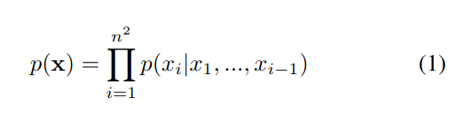

Auto-Regressive Model을 문자 그대로 해석하면 자동 회귀 모델이다. 즉 자신의 결과물을 다시 자신의 Input으로 재귀시키는 모델을 Auto-Regressive Model이라고 한다. 생성 모델, 특히 영상 도메인에서의 Auto-Regressive Model은 보편적으로 PixelRNN, PixelCNN과 그 후속, 파생모델들 따위를 일컫는다. 이 모델들은 영상을 생성할 때, 영상 전체를 한번에 생성하지 않고, 한 픽셀, 한 픽셀, 한 채널, 한 채널을 따로 따로 만든다. 각 픽셀을 생성할 땐, 지금까지 생성한 픽셀들이 입력으로 들어가 Context가 된다. 

위 수식에서 n은 영상의 Width 혹은 Height고, X는 영상, x는 각 픽셀을 의미한다.(구분을 위해 라틴 x는 대문자(X)로, 그리스 x는 소문자로(x) 쓰겠음.) i는 행의 번호를 의미한다. 즉 p(x_i)는 0번째 픽셀부터 i-1까지의 이미 만들어진 픽셀들이 prior로 주어졌을때, i번째 픽셀의 확률을 나타낸다. 이를 마지막 픽셀까지 곱해나가면 p(X), 즉 영상 전체의 확률을 명시적으로 얻을 수 있다.

[Pixel Recurrent Neural Networks](https://arxiv.org/pdf/1601.06759.pdf)에서는 Row LSTM, Diagonal BiLSTM, PixelCNN 세 모델을 소개했고, [Conditional Image Generation with PixelCNN Decoders](https://papers.nips.cc/paper/6527-conditional-image-generation-with-pixelcnn-decoders.pdf)에서는 PixelCNN의 진보한 버전인 Gated PixelCNN과 PixelCNN의 Conditional Model 버전을 소개했다.

# 3.Why Auto-Regressive?

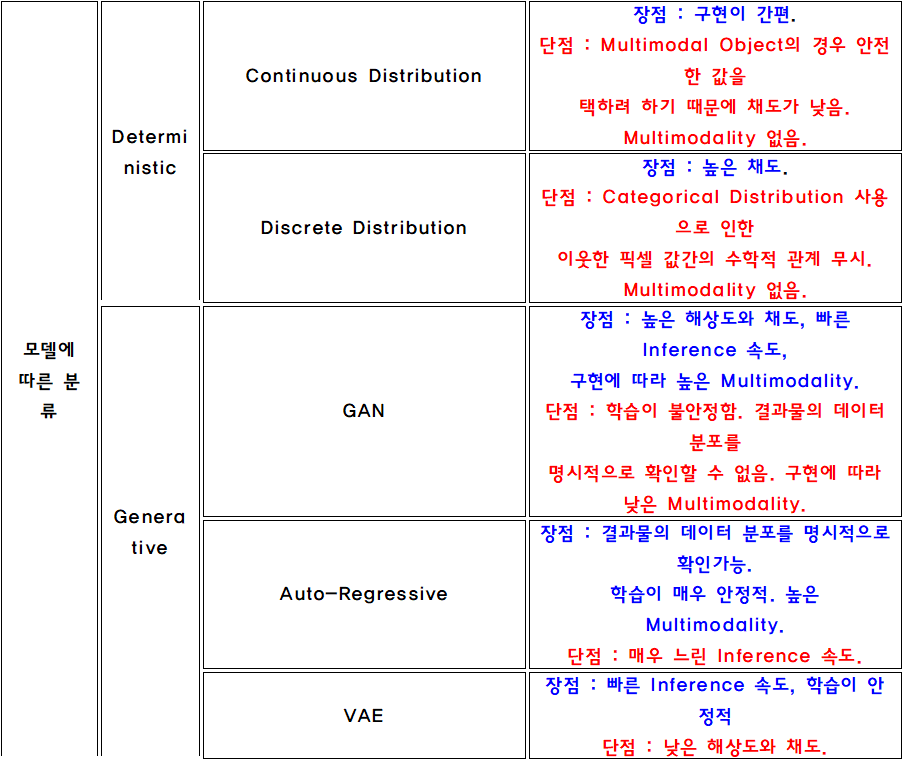

Auto-Regressive Model은 생성모델로서 여러 장점을 가지고 있는데, 결과물의 데이터 분포를 Log Likelihood로 명시적으로 파악할 수 있으며, 매우 안정적인 학습이 가능하고, 한 픽셀 한 픽셀을 확률분포에서 샘플링해가며 만드는 특성 상, 높은 Consistency와 Multimodality를 보여준다. 이러한 장점은 해당 모델이 Image Reconstruction, Super Resolution, Image Colorization등의 Task에서 GAN, VAE등과는 차별화되는 장점을 가질 수 있게 해줬다. 다만 매우 느린 Inference 속도 덕에, Realtime 처리에는 다소 부적합한 단점이 있다. 추가로 다른 생성모델들과의 비교는 [Survey](https://github.com/demul/auto_colorization_project/blob/master/README.md) 링크를 참조바란다.

# 4.Pixel Recurrent Neural Networks

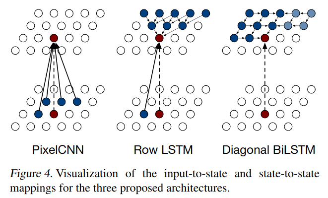

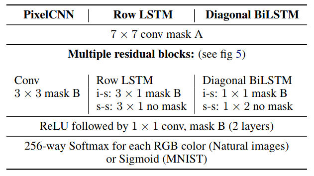

이 논문은 영상도메인에서 Auto-Regressive 모델을 대중화시킨 기념비적인 논문이면서, 동시에 아이디어 자체는 위대하지만 엉터리 설명으로 많은 연구자들을 분노하게 만든 악명높은 논문이다. 이 논문의 Contribution은 크게 네 가지로 볼 수 있다. 

첫 번째로, 이전에도 영상분야에 Auto-Regressive 모델을 적용하려는 시도([Generative Image Modeling Using Spatial LSTMs](https://arxiv.org/pdf/1506.03478.pdf))는 있었지만 Continuous Distribution을 사용하기 때문에 Multimodality를 표현하는데 있어서 비교적 Auto-Regressive Model만의 장점을 살리기 힘들었다. 이 논문은 Discrete Distribution을 사용하면서 이러한 문제점들을 해결하여 NLL(Nagative Log Likelihood)과 Multimodality 두 측면에서 모두 높은 성능을 끌어냈다. 

두 번째로, Row LSTM, Diagonal BiLSTM, PixelCNN 총 세 가지의 Auto-Regressive 모델을 제안하여 상황에 따라 Trade-off를 고려하여 적절한 모델을 골라 쓸 수 있게 했고, 이 모델들이 이전에 제안된 모델들과 비교했을 때 성능면에서 이점이 있음을 보였다.

세 번째로, Auto-Regressive Model에 Residual Connections을 적용하는 것을 제안하고, 적용했을 때 성능을 향상됨을 보였다.

네 번째로, PixelRNN의 Multi-Scale 버전 Variation을 제안하였다. 이 부분은 논문에서도 상당히 간략하게 언급되고, 이후로 딱히 이 구조를 활용하는 모델을 보지 못 했으므로 여기서 설명하진 않기로 한다.

위쪽 사진(Figure4)은 PixelCNN, Row LSTM, Diagonal BiLSTM이 픽셀간 Dependency를 구현하는 형태를 나타낸 것이다. 사진 아래의 Table 1은 이제부터 설명할 Row LSTM, Diagonal BiLSTM, PixelCNN의 구조를 간략하게 나타낸 것이다. 이제부터 설명하는 구조를 이해하기 위해 i-s, s-s 기호에 주의해야 한다.

이 논문에서 설명하는 모델의 Task는 맨 왼쪽, 맨 위, R픽셀에 랜덤한 값을 준 뒤, 이것으로 부터 시퀸셜하게 한 픽셀 한 픽셀씩 Likelihood가 높은 값들만 선택해가면서 그럴듯한(ImageNet이나 CIFAR10 데이터들과 같은 분포를 가지는) 영상을 만들어 내는 것이다. 

NLL을 측정할 때(Evaluation)는, 완전한 이미지 하나를 준 뒤, 각 픽셀을 예측할 때, 이전의 픽셀들이 모두 올바르게 예측되었을 것이라고 가정하고 Context로 이 완전한 Image(즉 Label)의 일부를 사용한다.(일종의 Teacher Forcing 느낌) 그리고 이렇게 예측된 픽셀 값을 Label의 픽셀 값과 비교한 Cross-Entropy-Error를 구한 뒤 저장하고, 예측한 픽셀값은 버리고, 다음 픽셀을 예측할 땐 다시 Label의 픽셀값을 사용한다. 이렇게 저장한 Cross-Entropy-Error를 모두 더한 값을 차원수(CIFAR10의 경우 32x32x3)로 나눈 값을 NLL로 한다.

## 4.1.Row LSTM

Figure4에서 볼 수 있듯, Row LSTM의 한 픽셀은 자신 바로 위의 세 픽셀과, 자신 왼쪽의 한 픽셀로 부터 state를 전달받는다. 이후 state를 전달한 위의 세 픽셀과 왼쪽의 한 픽셀이 동일한 형태로 자신 바로 위의 세 픽셀과, 자신 왼쪽의 한 픽셀로 부터 state를 전달받는 상황을 생각해 보라. 역삼각형 형태로 Dependency가 확장되는 것을 알 수 있다. 

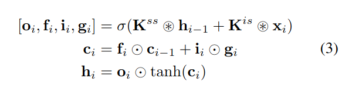

위 수식 (3)은 이러한 PixelLSTM 구조를 나타낸 것이다. x는 픽셀 값을 의미한다. o, f, i, g는 LSTM Gate들이고, c와 h는 Hidden State이다.  h_i-1은 바로 윗 행을 나타낸다. x_i는 현재행을 나타낸다.  ＊기호는 Convolution 연산을, ◎ 기호는 Element-Wise Pruduct를 나타낸다. σ 기호는 시그모이드 활성화함수를, tanh는 하이퍼볼릭탄젠트 활성화 함수를 나타낸다. K^ss는 State-to-State Weight로 윗 행의 State과 Conv되는 커널이고, K^is는 Input-to-State Weight로 현재 행의 픽셀값과 Conv되는 커널이다. 두 커널의 특징을 Table 1의 Row LSTM 부분 구조와 대조해서 살펴보길 바란다.커널의 형태와 Masked, Non-Masked 여부에 주목하라, 여기서 Masked가 뭔지 알아보겠다.

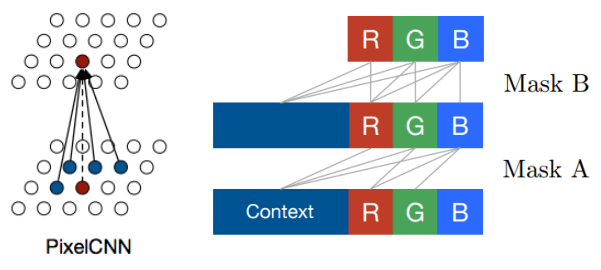

Masked Convolution은 위 그림과 같이 자신의 왼쪽과 위쪽을 제외한 나머지 영역의 Weight를 0으로 만든 Convolution을 의미한다. 즉 Dependency의 방향을 왼쪽, 위로 한정하기 위해 사용한다. Mask A는 현재 연산중인 픽셀의 채널을 Context에 포함하지 않는 방식이고, Mask B는 현재 연산중인 픽셀의 채널을 포함하는 방식이다. 현재 연산중인 픽셀과의 Dependency는 최초에 한번 끊어주면 되므로 Table 1에서 보는 것처럼 Mask A는 최초에 한번만 적용된다.

수식(3)에서 주의할 점은 **c, h, x는 Trainig시엔 병렬처리를 위해 h x n x 1의(여기서 h는 채널 수) 차원(한 행 전체)을 가진다는 것이다.**

하지만 **c_i-1과 h_i-1은 Inference시엔 h x 3 x 1(한 행 위의 픽셀 3개)의 차원을 가진다. 또한 x_i 역시 h x 3 x 1(자신 + 양 옆 픽셀, 단 오른쪽 픽셀은 Mask되므로 연산에 반영되진 않음)의 차원을 가진다. 다만 h_i는 Output으로 나오는 단 한 픽셀이므로 h x 1 x 1의 차원을 가진다.** 왜냐하면 Inference시에는 Trainig시처럼 이전 픽셀이 정확하게 예측되었다는 가정을 할 수 없으므로(Teacher Forcing 방법 사용이 불가능하므로) 한 픽셀 한 픽셀을 Sequential하게 만들어 나가기 때문이다. 

여기서 혼동이 생길 수도 있는데, PixelCNN에서 Evaluation과 Inference는 전혀 다른 차원의 문제다. Evaluation도 Label이 있는 데이터를 기준으로 Teacher Forcing 상황을 가정해서 병렬적으로 할 수 있지만, Inference는 Label을 모르는 상태이므로 반드시 한 픽셀 한 픽셀 Sequential하게 만들어 나가게 된다. 즉 병렬처리를 할 수 없는 상황이므로 h와 x는 h x 3 x 1의 차원을 가진 Parameter로 봐야 Trainig 방식과 Inference 방식 간의 혼동을 막을 수 있다.

이제 Inference시에, 맨 위, 맨 왼쪽 픽셀부터 이러한 방식으로 한 픽셀 한 픽셀 만드는 상황을 생각해보자. 각 픽셀은 상단으로 역삼각형 형태의 Dependency를 갖게 되므로, 우측 하단으로 Context에 반영해야 하지만, 반영하지 못하는 꽤 큰 영역이 생기게 된다. 이런 영역을 Blind Spot이라고 한다. Row LSTM은 이러한 Blind Spot으로 인해 밑에 설명할 Blind Spot이 아예 없는 Diagonal BiLSTM에 비해 높은 NLL을 갖는다.(당연히 높을 수록 안 좋은 Score다.) 다만 더 간단한 연산방식으로 Diagonal BiLSTM에 비하면 더 빠른 속도를 보여준다. 

## 4.2.Diagonal BiLSTM

Figure4에서 볼 수 있듯, Diagonal BiLSTM LSTM의 한 픽셀은 자신 바로 위의 한 픽셀과, 자신 왼쪽의 한 픽셀로 부터 state를 전달받는다. 다만 이 픽셀들이 왼쪽 위 끝부터 오른쪽 위 끝까지 완전하게 연결되어 있다. 즉 PixelRNN의 최초 컨셉과 완전히 일치하는 Dependency Field를 갖는다. 

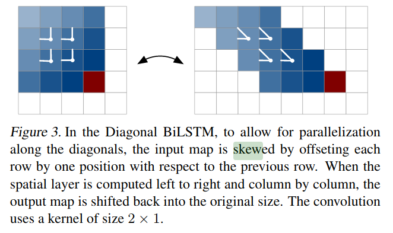

Diagonal BiLSTM은, 한 픽셀이 자신 바로 위의 한 픽셀과, 자신 왼쪽의 한 픽셀로 부터 state를 전달받는 과정을 효율적으로 병렬화하기 위해서 Feature Map을 Skew하는 트릭을 사용한다. 이렇게 하면 1 x 2 모양 Convolution 커널하나로 왼쪽, 위 픽셀로 부터 현재 픽셀로 State를 전달할 수 있다. Diagonal BiLSTM에서는 이 1 x 2 Non-Masked Convolution 커널이 State-to-State 커널이 된다. 또한 자기 자신으로부터도 State를 전달받아야 하므로 1 x 1 Masked Convolution을 사용하는데 이게 Input-to-State 커널이 된다. 

여기서 1 x 1 커널인데 Masked Convolution 커널이라는게 도대체 무슨 뜻인지 헷갈릴 수 있다. 하지만 위 Masked Convolution 설명을 다시 보면 Masked Convolution은 채널간에도 Mask를 적용하므로, 1 x 1이라서 x축, y축 차원으로는 Masking이 없지만 채널 차원으로 Masking이 있는 Convolution이라고 생각하면 쉽게 이해할 수 있다.

Diagonal BiLSTM에서 각 픽셀의 State를 계산하는 수식은 Row LSTM에서 사용하는 수식(3)과 같다. 

다만 Feature맵을 Skew하는 트릭을 사용하기 때문에(그리고 당연히 커널 모양도 다르기 때문에) **Trainig시에 c와 h, x의 차원은 h x 1 x n이 될거고(Row LSTM의 차원과 비교하면 x축, y축이 Transpose되었음에 주목하라!)**

**Inference시엔 c_i-1, h_i-1의 차원은 h x 2 x 1(Skew된 Map을 기준으로 현재 픽셀에서 9시 방향과 11시 방향 픽셀), x_i-1의 차원은 h x 1 x 1(자기 자신 한 픽셀)이 될 것이다. 또한 h_i는 Output으로 나오는 단 한 픽셀이므로 h x 1 x 1의 차원을 가진다.** Table 1에서 i-s 커널과 s-s 커널의 모양을 보면 위에서 설명하는 바와 일치함을 알 수 있다.

이제 Inference시에, 맨 위, 맨 왼쪽 픽셀부터 이러한 방식으로 한 픽셀 한 픽셀 만드는 상황을 생각해보자. 각 픽셀은 자신을 기준으로 -90º ~ 0º 범위에 있는 모든 픽셀에 Dependency를 갖게 된다. 그러나, 현재 행을 제외한 0º ~ 90º 범위에 있는 픽셀들은 Dependency를 가져야 하나 여전히 갖지 못한 Blind Spot이 된다. 이를 해결하기 위해 간단한 트릭이 적용된다.

오른쪽->왼쪽 Hidden State Map(0º ~ 90º)을 왼쪽->오른쪽 Hidden State Map(-90º ~ 0º)에 간편하게 더해주기 위해서, Figure 3과 같은 방식으로 Parallelization 하되(이 경우 왼쪽으로 Skew) 아웃풋 맵을 전부 한칸씩 밑으로 내려서, 왼쪽->오른쪽 Hidden state에 더한다. 만약 한칸 씩 밑으로 안 내린다면 해당 픽셀이 미래 정보(자기와 같은 열 오른쪽에 있는)를 보게된다.

이와 같은 방법으로 두 Hidden State Map들을 더하면 Blind Spot이 아예 없는 것을 알 수 있다. Diagonal BiLSTM은 이러한 특성으로 인해 이 논문에 소개된 모델들 중 가장 낮은 NLL과 가장 느린 속도를 보여준다. 

## 4.3.PixelCNN

LSTM Gate를 사용하지 않고도 각 픽셀이 좌상단에 Dependency를 갖게 할 수 있는 방법으로, PixelCNN이 있다. 위 그림에서 보는 것처럼 Masked Convolution 커널을 중첩시키는 것 만으로도 이를 구현할 수 있다. 다만 Dependency Filed가 중첩된 Layer수에 따라 선형적으로 증가한다는 점(즉 충분히 Convolution 커널을 쌓지 않으면 Dependency Filed 크기가 작다는 점), LSTM Gates와 같은 Multiplicative Unit이 없어 모델의 표현력이 떨어진다는 점, 그리고 Row LSTM처럼 Blind Spot이 존재한다는 점 등의 한계로 인해 이 논문에 소개된 세 모델 중 가장 높은 NLL을 보여준다. 다만 느리기로 악명높은 LSTM Unit을 아예 사용하지 않기 때문에 가장 빠른 속도를 가지고 있다.

## 4.4.Residual Connections

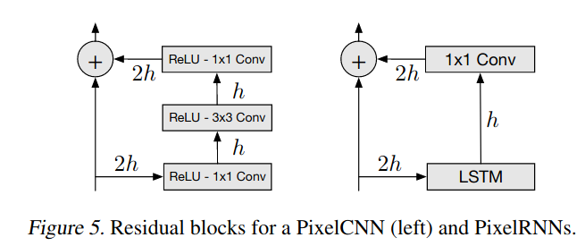

이 논문에 소개된 모델들에 적용된 Skip Connection을 보여주는 그림인데, 뜬금없이 차원수가 2h로 불어나 있는 부분이 의아할 것이다. 이 논문 읽다가 상당히 헷갈렸던 부분인데, 진짜 저자를 만나면 몇 대 때려주고 싶은 생각이 들었다. LSTM계열 모델의 경우, 위 수식 (3)에서 State만 출력하고, 현재 픽셀의 연산 후 값을 출력하는 부분이 없는데, 2h가 i-s와 s-s의 두 차원을 의미하고, Input-to-State 커널이 차원을 감소시킨다는 논문의 언급(The input-to-state component reduces the number offeatures by producinghfeatures per gate)에서 유추해 볼 때, 현재 픽셀값은 Residual Unit에서 1x1 Convolution을 통해 차원증가하면서 구해지는 것이라고 추리해 볼 수 있다. 

다만 이 부분은 확실하지 않으며 또 다른 Logic으로, h가 그 자체로 State면서 픽셀값을 의미하고, 단순히 LSTM Unit이 차원수를 절반으로 감소시키고 1x1 Convolution을 통해 복원하는, 즉 h_i-1이 128차원일 때 막 수식(3)을 통과해 구한 h_i는 64차원이고 바로 이어지는 1x1 Convolution을 통해 128차원으로 복원되는 Logic을 가정해 볼 수 있다.

# 5.Conditional Image Generation with PixelCNN Decoders

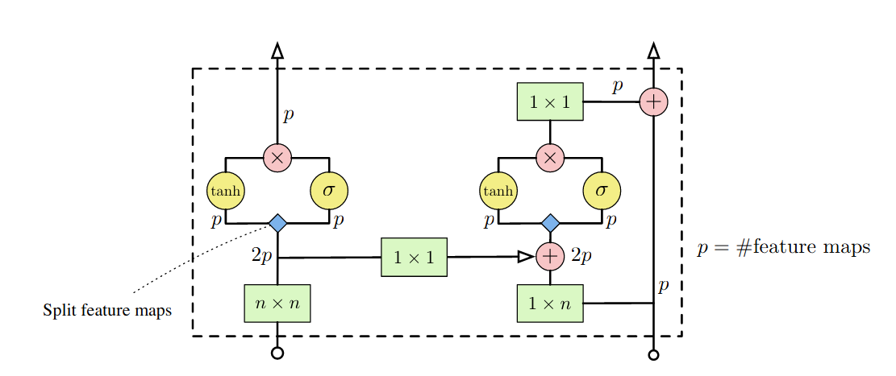

Pixel Recurrent Neural Networks의 후속논문으로, 같은 저자가 쓴 만큼 설명이 매우 엉터리이다. 이 논문의 주요한 Contribution은 크게 세 가지로 볼 수 있다. 

첫 번째로 매우 빠르지만 PixelRNN계열의 모델들 보다 성능이 떨어졌던 PixelCNN의 약점들을 분석하고 보완하여, 매우 빠르면서 Diagonal BiLSTM에 준하는 성능을 가진 Gated PixelCNN 모델을 제안했다. 

두 번째로 PixelCNN의 Conditional Model로서의 가능성을 제안하고 증명했다. 

세 번째로 PixelCNN Auto-Encoder로써의 (Representation Encoder로써의) 가능성을 제안하고 증명했다. 

여기서는 앞의 두 가지만 다루도록 한다. Auto-Encoder 부분은 다른 두 파트에 비하면 비교적 쉽게 쓰여있기 때문에 논문만 봐도 이해하는데 무리가 없을 것이다.

## 5.1.Gated Convolutional Layers

위 4.3.PixelCNN에서 언급했듯이, PixelCNN은 Masked Convolution 커널을 중첩시키는 것으로 Auto-Regressive Model의 Dependency Conditioning을 구현한 모델이다.

LSTM Unit을 아예 사용하지 않기 때문에 LSTM계열 Auto-Regressive Model들보다 빠른 속도를 가지고 있지만, Dependency Filed가 중첩된 Layer수에 따라 선형적으로 증가한다는 점(즉 충분히 Convolution 커널을 쌓지 않으면 Dependency Filed 크기가 작다는 점), LSTM Gates와 같은 Multiplicative Unit이 없어 모델의 표현력이 떨어진다는 점, 그리고 Row LSTM처럼 Blind Spot이 존재한다는 점 등의 한계로 인해 LSTM계열 Model들보다 떨어지는 성능을 가지고 있었다.

이 논문에서 저자는 제한된 Dependency Filed 크기의 문제는 Convolutional Layer를 충분히 많이 중첩시킴으로서 비교적 간단히 해결할 수 있다고 주장한다. 그리고 모델의 표현력이 떨어지는 문제는 Gated Activation Unit이라는 기존의 활성화 함수를 대체하는 Multiplicative Unit을 도입하여 해결한다. 마지막으로 Blind Spot의 문제는 신경망을 Vertical Stack과 Horizental Stack의 2 Way로 나눔으로서 각 Stack에 서로 다른 Receptive Filed를 가진 데이터가 흘러가게 하고 중간 중간에 한 쪽으로 데이터를 제공함으로서 해결한다.

### 5.1.1.Gated Activation Unit

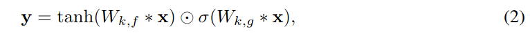

Gated Activation Unit은 LSTM Gates와 같은 Multiplicative Unit이 없어 모델의 표현력이 떨어진다는 점을 보완하기 위해 도입되었으며, 기존의 활성화 함수를 대체한다. 수식은 위와 같다. tanh는 하이퍼볼릭 탄젠트 활성화함수를 나타내며, σ는 시그모이드 활성화함수는 나타낸다. k는 채널 수, x는 입력, y는 출력이다. ＊은 Convolution 연산을 ◎는 Element-wise Product 연산을 나타낸다. 

W는 각각 다른 활성화함수를 통화하는 채널(f, g)에 각각 곱해진다. 이 부분을 한 번에 처리하기 위해 위 그림에서 보이듯, 연산결과 2k개의 채널을 가진 Feature Map이 나오도록 Convolution한다. 이후 k개의 채널을 가진 Feature Map, f와 g로 나누고, Element-wise Product해서 다시 k개의 채널을 가진 Feature Map으로 만든다.

### 5.1.2.Split CNN into Two Stack

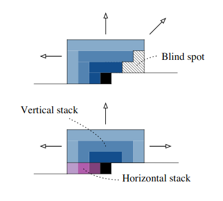

PixelCNN에는 Blind Spot이 존재하게 되는데, 이 문제를 신경망을 Vertical Stack과 Horizental Stack의 2 Way로 나눠 각 Stack에 서로 다른 Receptive Filed를 가진 데이터가 흘러가게 하고, 중간 중간에 Vertical Stack에서 Horizental Stack 쪽으로 데이터를 제공함으로서 해결한다. 아래쪽 그림에서 왼쪽이 Vertical Stack, 오른쪽이 Horizental Stack이다. 보이는 바와 같이 Gated Activation Unit을 통과하기 전 2k의 채널을 가진 상태에서 데이터를 보낸다. 또한 Horizental Stack쪽 Feature Map과 합쳐지기 전에 한 번의 1 x 1 Convolution을 거친다.

논문에선 Vertical Stack을 위쪽에 있는 모든 행에 대하여 Conditioning하는 Stack으로 Horizental Stack을 현재 픽셀의 왼쪽에 대해서만 Conditioning하는 Stack으로 설명하고 있다.

Horizental Stack은 사실 직관적으로 쉽게 이해가 간다. 각 픽셀이 자신의 왼쪽에 대해서만 Dependency을 가지도록 하고 싶다면 Masked k x 1 Convolution 커널을 만들어서 우측만 0으로 만들고 Convolution을 충분히 중첩시키면 될 것이다. 

그렇다면 Vertical Stack은 어떻게 작동하는 것인지 알아보자, 사실 이 부분이 논문에 너무 대충 설명되어 있어서, 오해할만한 부분이 꽤 많고, 나도 완전히 이해하기까지 꽤 오래걸렸다.

사실 Vertical Stack이 Horizental Stack에 더해지는 부분은, 4.2.Diagonal BiLSTM에서 오른쪽->왼쪽 Hidden State Map(0º ~ 90º)을 왼쪽->오른쪽 Hidden State Map(-90º ~ 0º)에 더해주는 부분과 꽤 유사한 트릭을 사용한다. 이 부분은 그림으로 보는 편이 이해하기 쉽기 때문에 내가 직접 그린 그림으로 설명한다.

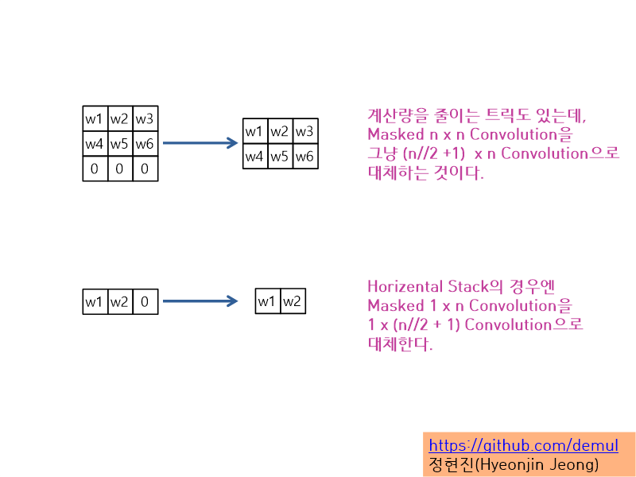

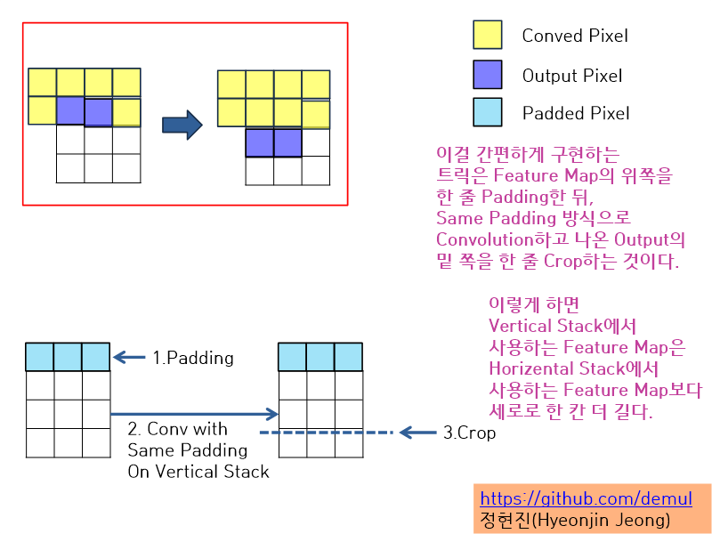

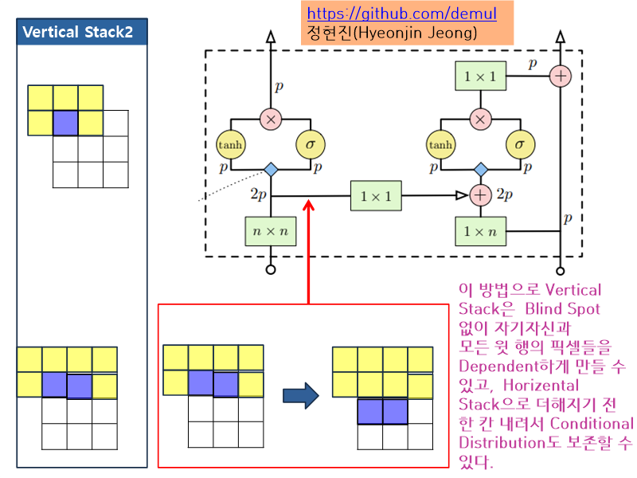

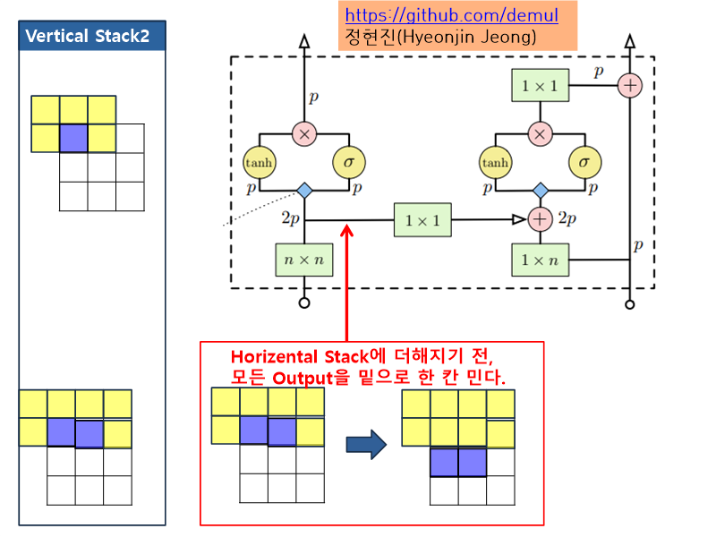

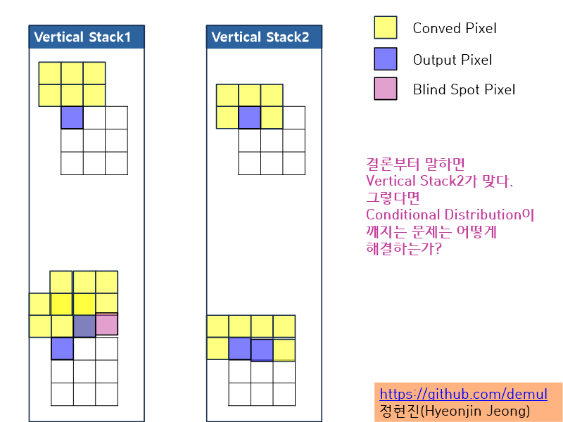

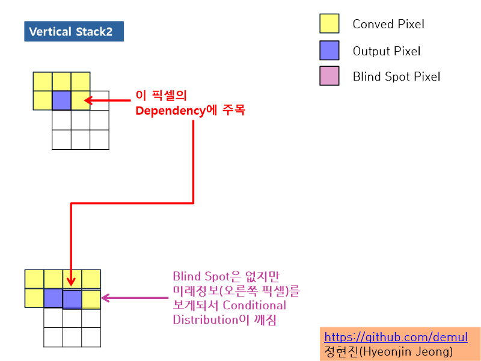

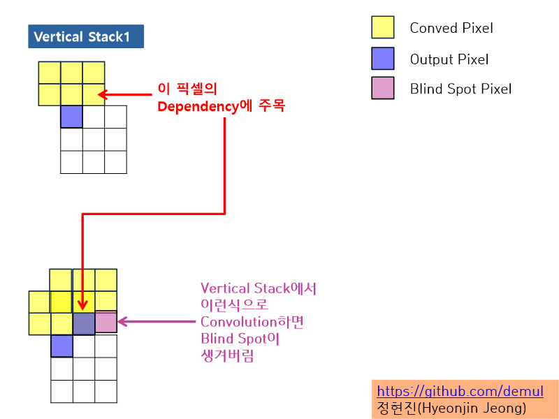

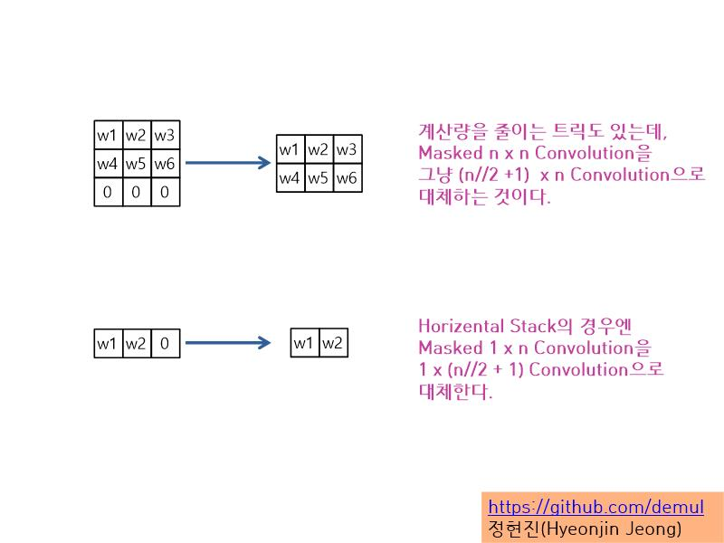

즉 Vertical Stack에 흐르는 Feature Map은 현재행을 포함해서 위쪽에 위치한 모든 픽셀에 대해(-90º ~ 90º) Conditioning되어 있는 Feature Map이지만, 이를 한칸 씩 내리게 되면 현재행을 제외하고 위쪽에 위치한 모든 픽셀에 대해(-90º ~ 90º) Conditioning되어 있는 Feature Map이 되고, 여기에 Horizental Stack에 흐르고 있는, 현재행에서 현재 픽셀의 좌측에 있는 모든 픽셀에 대해 Conditioning되어 있는 Feature Map을 더하게 되면 Diagonal BiLSTM과 같은 Conditional Distribution을 가지게, 즉 Blind Spot이 아예 없게 된다.

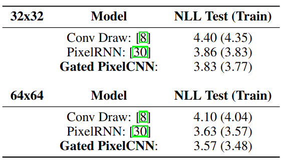

위 테이블은 이와 같은 방식으로 약점을 극복한 Gated PixelCNN이 PixelRNN(Diagonal BiLSTM)보다 소폭 향상된 성능을 냄을 보여준다.

## 5.2.Conditional Gated PixelCNN

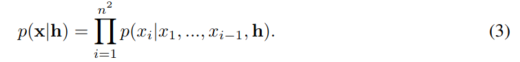

PixelCNN의 Conditional 버전은 위 수식과 같이 계산된다. PixelCNN의 수식에서 하나 추가된 것이 h인데, h는 Condition을 나타낸다. h는 One-hot Encoding이 될 수도 있고, Embbeding Vector가 될 수도 있고, 아예 영상이 생으로 들어갈 수도 있다.

Condition이 적용된 Gated PixelCNN은 위와 같은 수식으로 정리할 수 있다. 기존의 Gated PixelCNN 수식에, f Feature Map과 g Feature Map 각각에 Condition을 더해주기 위해, h를 Feature Map과 같은 차원으로 내적시켜주는 Parameter인 V가 추가되었다.

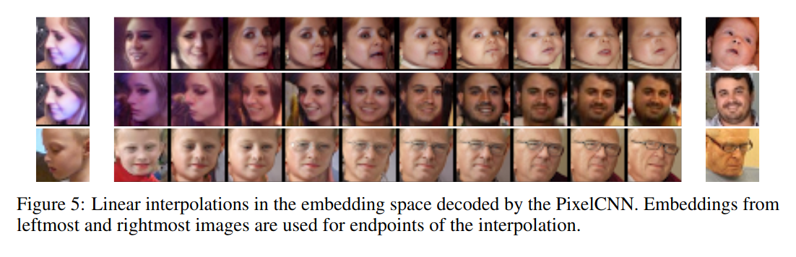

위 그림은 Conditional PixelCNN을 Conditional Image Generation에 사용한 예시를 보여준다. 두 영상의 Embbeding Latent Vector를 Cross Disolve시켜가며 다양한 영상을 생성하는 모습을 보여준다. 이외에도 Conditional PixelCNN은 Super Resolution([Pixel Recursive Super Resolution](https://arxiv.org/pdf/1702.00783.pdf))이나 Auto Colorization([PixColor: Pixel Recursive Colorization](https://arxiv.org/abs/1705.07208))등에 사용된다.

[PixColor: Pixel Recursive Colorization](https://arxv.org/abs/170.07208)에 대해선 별도로 내가 직접 구현중인 [Auto Colorization Project Repository](https://github.com/demul/auto_colorization_project)에 정리해 놓았다.

## 6.Finishing Comment

Auto-Regressive Model들을 공부하면서 너무나도 많은 고통을 받았다. 논문들이 대체로 "너 이거 당연히 알제?"하는 식으로 쓰여 있었기 때문이다. Deepmind는 아이디어는 정말 우수한데 그 아이디어를 너무 대충 풀어쓰는 것 같다. 얘네 논문을 읽고 있자니 아이디어도 우수하고 논문으로서의 완결성도 완벽하고 심지어 재현성도 엄청나게 높은 논문들을 쏟아내는 FAIR가 진짜 대단한 조직이라는 생각이 문득 들었다. 특히 Kaiming He는 거의 신적인 존재라는 생각이 들었다.

아무튼 내가 다음에 Auto-Regressive Method를 다시 공부해야할 일이 생겼을 때 지금과 같은 고통을 받지 않기 위해, 그리고 혹시라도 Auto-Regressive Model을 공부하다가 우연히 내 깃허브를 본 사람들을 최대한 고통에서 빨리 해방시켜주기 위해 많은 시간을 할애해 본 문서를 작성하였다.

본 문서에서 이해가 되지 않거나 잘못된 내용이 있으면 꼭 Issue를 남겨주시길 바란다.
